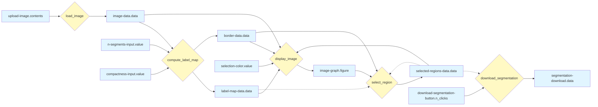

# Developer guide

The project is implemented using [Dash](https://dash.plotly.com/) in Python.

The project source code is organised as follow:

```
.
├─ src/
|   ├─ ui/
|   |   ├─ callbacks/
|   |   └─ pages/
|   └─ compute/
└─ app.py
```

The `app.py` file is the entrypoint of the application. It may be run using the
`uv` package and project manager.

The `src` directory is divided into two directories:

* `compute/`: contains all the code to perform computation in the application.
  It may contains code to perform computation on the application server or to
  make external API calls.
* `ui/`: contains all the Dash related code. It is divided into a `pages/`
  directory, that contains the user interface and the Dash functionalities, and
  a `callback/` directory, that contains the whole code called by the callbacks
  (but not the callbacks theirselves).

## Callback state machine

The diagram below illustrates the chaining of the callbacks in the application.

