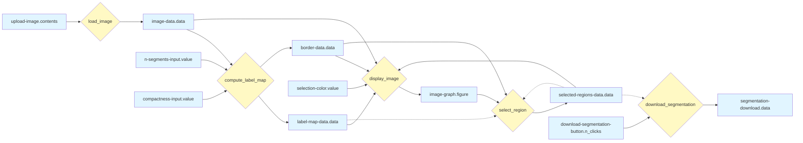

# Developer guide

## Callback state machine

```mermaid
graph LR
    upload-image["upload-image.contents"]
    image-data["image-data.data"]
    n-segments["n-segments-input.value"]
    compactness["compactness-input.value"]
    label-map["label-map-data.data"]
    border["border-data.data"]
    selected-regions["selected-regions-data.data"]
    selection-color["selection-color.value"]
    image-graph["image-graph.figure"]
    download-btn["download-segmentation-button.n_clicks"]
    segmentation-dl["segmentation-download.data"]
    
    load{load_image}
    compute{compute_label_map}
    display{display_image}
    select{select_region}
    download{download_segmentation}
    
    upload-image --> load
    load --> image-data
    
    image-data --> compute
    n-segments --> compute
    compactness --> compute
    compute --> label-map
    compute --> border
    
    image-data --> display
    label-map --> display
    selected-regions --> display
    border --> display
    selection-color --> display
    display --> image-graph
    
    image-graph --> select
    border --> select
    selected-regions -.-> select
    label-map -.-> select
    select --> selected-regions
    
    download-btn --> download
    selected-regions -.-> download
    download --> segmentation-dl
    
    classDef data fill:#e1f5ff
    classDef callback fill:#fff9c4
    class upload-image,image-data,n-segments,compactness,label-map,border,selected-regions,selection-color,image-graph,download-btn,segmentation-dl data
    class load,compute,display,select,download callback
```